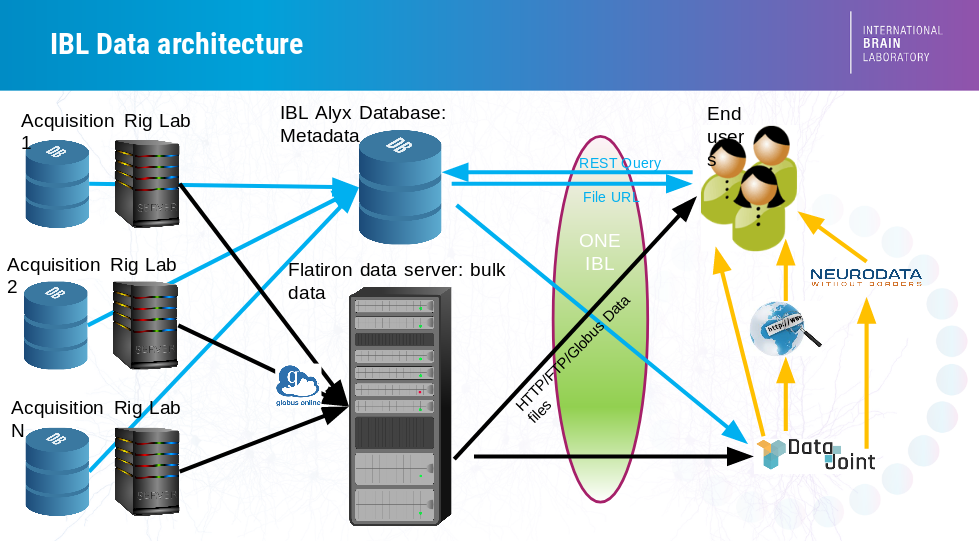

# Introduction to the IBL data architecture

In the IBL, data is acquired in various laboratories spread across countries, and needs to be centralized into a common database accessible to all from anywhere in the world, at all times.
This challenge is met by the IBL data architecture, described briefly below; a thorough description can be found on [**Biorxiv**](https://www.biorxiv.org/content/10.1101/827873v3).

Once acquired on a Rig, the data is first registered by the local server associated to that Rig onto two databases:
- [**Alyx**](https://github.com/cortex-lab/alyx), that stores **meta-data** (e.g. information on the mouse) in a relational manner.
- [**Flatiron**](https://www.simonsfoundation.org/flatiron/), that stores **bulky raw data** (e.g. raw electrophysiology and video data) as well as **pre-processed data** (e.g. output of spike sorting, output of video segmentation). This database is accessible through HTTP, FTP and Globus.

The Alyx database points to the files on the Flatiron server.
These files are in the [ALF](04_alf) format.

A specific set of lightweight, processed data (e.g. events on trials, spike times), **not raw data**, are then transferred onto a third database that enables further scientific analysis:
- [Datajoint database](https://datajoint.io), that stores specific **processed, lightweight data** commonly used in analysis.

An example of such analysis is to compute a subject's behavioral performance on a given day.

The Flatiron and Datajoint databases each have a dedicated public portion, onto which are stored datasets that can be accessed by anyone.
If you are interested in accessing these publicly available datasets, please visit this [section](08_public).

## Summary of tools to access the data
There are two main ways to access the data; using either:
-   [**ONE**](03_one): a set of normalized functions that queries the Alyx database and downloads the (raw and pre-processed) data files from the FlatIron.
-   [**Datajoint**](05_datajoint): a framework to access and analyse the (lightweight, commonly-used) data stored into the Datajoint database.
